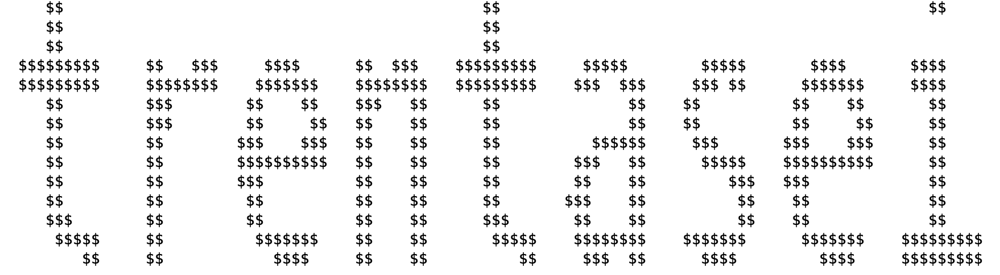
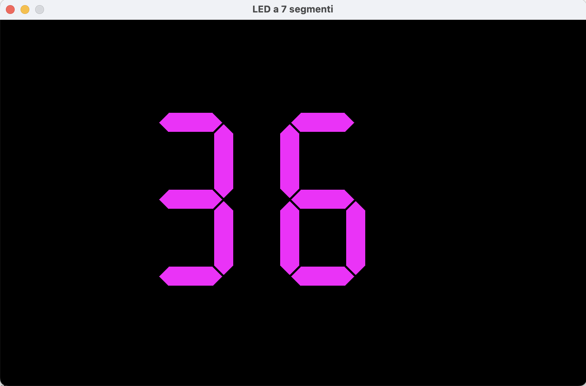

# Java Number Visualizer 🔢

A Java console application that generates random numbers and renders them in various artistic formats: standard text, decorative ASCII Art, and a simulated 7-segment LED display (digital clock style).

## Preview

Here is how the program output looks:

### 🎨 ASCII Art Renderer
Block-style artistic visualization:


### 📟 7-Segment Display Renderer
Digital LED display simulation:


---

## 🚀 Features

* **Random Generation:** Generates random integer numbers.
* **ASCII Art:** Renders numbers using text characters to form giant digits.
* **7-Segment Display:** Logical simulation of LED segments (on/off) to form numbers.
* **Text Output:** Displays the number in standard string format.

## 🛠 Technologies Used

* **Language:** Java (JDK 8+)
* **Build Tool:** Maven
* **Recommended IDE:** Apache NetBeans

## 💻 How to Run the Project

1.  **Clone the repository:**
    ```bash
    git clone [https://github.com/imadchatraoui/Java-Number-Visualizer.git](https://github.com/imadchatraoui/Java-Number-Visualizer.git)
    ```

2.  **Open with NetBeans:**
    * Open Apache NetBeans.
    * Go to `File` -> `Open Project`.
    * Select the `Java-Number-Visualizer` folder (NetBeans will automatically recognize the Maven icon).

3.  **Run:**
    * Right-click the project in the left panel.
    * Click on **Run** (or press F6).
    * Watch the output in the console!

## 📂 Project Structure

```text
Java-Number-Visualizer/
├── assets/
│   └── images/
│   └── media/           # Screenshot and media
├── src/
│   └── main/java/       # Java source code
├── pom.xml              # Maven configuration
└── README.md            # Documentation
```
